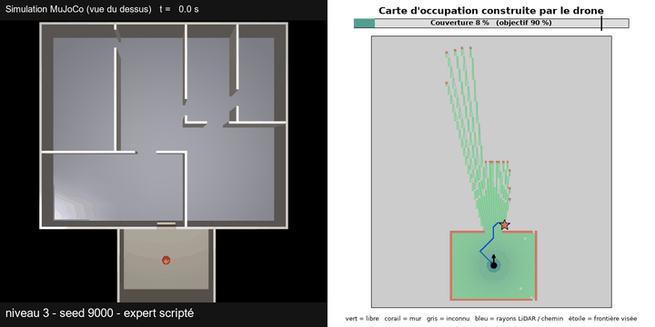
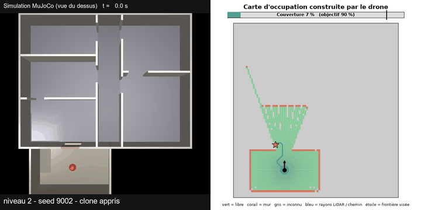
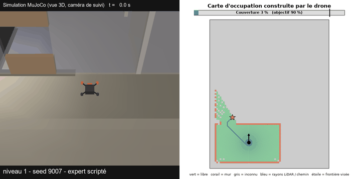

# Scanner

A simulated drone enters an unknown house through a window and maps it live with a 2D LiDAR, with no prior plan of the building. A classical planner decides where to go, a neural policy flies there, and a tuned PID cascade keeps the drone stable.

<p align="center">
  
</p>

*Level 3 house (loops, several doors): 98% of the map in 21 s. Left: the simulation. Right: the occupancy map built live, with LiDAR rays, the target frontier (star) and the BFS path (blue).*

## Results

Success rate on unseen houses (success = 90% of the reachable area mapped, no crash):

| | Level 1 | Level 2 | Level 3 | Level 4 |
|---|---|---|---|---|
| Scripted explorer (BFS planner) | 100% | 100% | 95% | 85% |
| Neural policy (imitation of the explorer) | 100% | 93% | 60% | 53% |

Level 1 is a small house (3-4 rooms), level 4 a large one (8-10 rooms, loops, doors of 1.0-1.3 m).

- **Hybrid architecture:** BFS toward the nearest unexplored area, a neural policy that follows it, a velocity-to-attitude PID cascade at the bottom.
- **Flight control:** attitude loop rise time cut from 414 ms to 76 ms. A seed that failed with every earlier configuration went from 7% to 87%.
- **Smooth commands:** a smoothness regulariser (CAPS) makes commands 4x smoother and reaches 100% success on the chain buildings.
- **Procedural houses:** 4 difficulty levels, 1,200 generated plans checked for physical accessibility by a drone of real size.
- **Negative result, measured:** pure end-to-end RL reaches at best 27% on level 1 houses (see [Research finding](#research-finding-pure-rl-on-houses)).

## More demos

<p align="center">
  
</p>

*Level 2, neural policy trained by imitation: 98.5% in 13 s.*

<p align="center">
  
</p>

*Level 1, 3D follow camera (walls drawn translucent, the orange side is the drone's front): 100% in 7 s.*

All gifs are sped up and run on seeds the controllers never saw.

## How it works

```
2D LiDAR (180 rays) -> occupancy grid (15 cm) -> frontiers + BFS path
                                                       |
                         neural policy or script  <----+
                                  |
                       velocity setpoint (max 6 m/s)
                                  |
              PID cascade: velocity -> attitude -> angular rate
                                  |
                       motor torques -> MuJoCo
```

- **Environment:** a new house every episode. The only entrance is a window in the south wall, reached from a closed courtyard.
- **Frontiers and planning:** a frontier is a free cell next to unknown space. A BFS over known free cells, kept 0.45 m from walls, gives the path distance and the first step toward the nearest frontiers.
- **Controller:** fixed altitude of 1.2 m, attitude limited to 35 degrees. The nose follows the direction of motion (display only, the network works in the world frame).
- **Policy network:** MLP on 16 distance sectors, the BFS frontier vector and velocity, plus a CNN on a 3 x 64 x 64 local map crop. Trained by imitation of the script, or by PPO + CAPS for the pure RL runs.

## Research finding: pure RL on houses

The initial goal was to learn exploration end to end with RL. It works on simple chain buildings (100%), but not on realistic houses: 27% at best on level 1, across seven variants (BFS compass, progress reward, stagnation penalty, coarser map, other discount factor). One seed and 30 houses give about +-8 points, so these variants are statistically indistinguishable. What changes is how they fail: crashing into walls, or standing almost still (95% of the steps without discovering a cell).

The straight-line direction to the nearest frontier crosses a wall in 80-99% of the steps, but replacing it with a BFS path did not fix the success rate. No cause is isolated. Exploration noise inside doors with +-0.5 m clearance is the most likely one.

Full tables, version history and measurements: [docs/experiments.md](docs/experiments.md).

## Limits

- The neural policy imitates the script and receives its BFS direction as an input: it does not discover where to go by itself.
- Exact pose from the simulator (no SLAM), 2D LiDAR at a fixed altitude, one floor.
- Most RL runs use a single seed, with 30 evaluation houses (the expert is measured on 20 per level).
- Mean tilt is still high (about 30 degrees).

## Reproduce

```
pip install -r requirements_runner.txt imageio imageio-ffmpeg

# demo gifs
python src/make_demo.py --level 2 --seeds 9002 --stride 4 --gif --out demo
python src/make_demo.py --policy clone --model bc2_s42 --level 2 --seeds 9002 --stride 4 --gif --out demo

# imitation of the scripted explorer, then evaluation
python src/imitate.py --name bc2_s42 --samples 80000 --epochs 25
python src/evaluate.py --name bc2_s42 --n-episodes 30 --building house --house-level 3 --max-steps 3000
```

Run each script with `--help` for all options.

<details>
<summary>Project layout</summary>

| File | Purpose |
|---|---|
| `src/explorer_env.py` | Gymnasium environment (physics, LiDAR, reward, PID cascade) |
| `src/house_generator.py` | House generator, 4 levels, accessibility check |
| `src/building_generator.py` | First generator (chains of rooms) |
| `src/occupancy_grid.py` | Occupancy grid, frontier detection, BFS features |
| `src/expert.py` | Scripted explorer used as teacher |
| `src/imitate.py` | Imitation of the explorer by the policy network |
| `src/caps_ppo.py` | PPO with the CAPS smoothness regulariser |
| `src/train.py`, `src/evaluate.py` | Training and evaluation |
| `src/make_demo.py` | Split-screen demo videos |

</details>

**Stack:** MuJoCo, Gymnasium, Stable-Baselines3, PyTorch, NumPy, matplotlib, imageio.