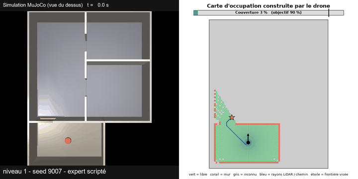

# Scanner

A simulated drone enters an unknown house through a window and builds an occupancy map of it from a 2D LiDAR (MuJoCo).




Full-length videos (left: simulation, right: the map as it is built, with LiDAR rays, target frontier, BFS path and coverage). The gifs above play inline; the mp4 files open in the browser's player.

| Controller, view | Level 1, seed 9007 | Level 2, seed 9002 | Level 2, seed 9003 |
|---|---|---|---|
| Scripted explorer, top view | [mp4](demo/demo_expert_niveau1_seed9007.mp4) | [mp4](demo/demo_expert_niveau2_seed9002.mp4) | [mp4](demo/demo_expert_niveau2_seed9003.mp4) |
| Scripted explorer, 3D follow camera | [mp4](demo/demo_expert_niveau1_seed9007_3d.mp4) | [mp4](demo/demo_expert_niveau2_seed9002_3d.mp4) | [mp4](demo/demo_expert_niveau2_seed9003_3d.mp4) |
| Learned policy (imitation), top view | [mp4](demo/demo_clone_niveau1_seed9007.mp4) | [mp4](demo/demo_clone_niveau2_seed9002.mp4) | [mp4](demo/demo_clone_niveau2_seed9003.mp4) |
| Learned policy (imitation), 3D follow camera | [mp4](demo/demo_clone_niveau1_seed9007_3d.mp4) | - | [mp4](demo/demo_clone_niveau2_seed9003_3d.mp4) |

The videos are slightly sped up (x1.25 at level 1, x1.7 at level 2), run until nothing new is discovered, and use evaluation seeds the controllers were not trained on. Final coverage is 98.5-100%: the coverage metric also counts cells inside wall volumes, which no sensor can see.

## Summary

- Pure reinforcement learning (PPO) did **not** learn to explore the generated houses: at best 27% success on the easiest level (30 houses, one seed), whatever reward, input or horizon variant was tried.
- A scripted frontier explorer (BFS path to the nearest frontier, wall margin, avoidance reflex) succeeds on 100 / 100 / 95 / 85% of houses at levels 1 to 4 (20 houses per level).
- A neural network trained by imitation of that script reaches 100 / 93 / 60 / 53% (30 houses per level). It receives the BFS direction as an input, so it does not plan by itself.
- What transfers regardless of the planner: a tuned velocity-to-attitude PID cascade, a temporal smoothness regulariser (CAPS) that makes commands 4x smoother, a procedural house generator with a physical accessibility check, and a measured diagnosis of why pure RL fails.

## How it works

- **Environment**: a new building every episode. Level 1: about 10 x 8 m, 3-4 rooms, 1.3-1.5 m window. Level 4: 17-21 m, 8-10 rooms, loops, doors of 1.0-1.3 m. The only entrance is a window in the south wall, reached from a closed courtyard where the drone starts. 1,200 generated plans were checked: every room is reachable by a drone of real size.
- **Perception**: 180-ray horizontal LiDAR (range 15 m) updating a 15 cm occupancy grid (free / occupied / unknown). The pose is exact (given by MuJoCo, no SLAM).
- **Frontiers and planning**: a frontier is a free cell next to unknown space. A BFS over the known free cells, kept 0.45 m away from walls (reduced step by step when no path exists, for narrow doors), gives the path distance and the direction of the first step toward the nearest frontiers.
- **Controller**: the network (or the script) outputs a horizontal velocity setpoint (max 6 m/s, fixed altitude). A PID cascade (velocity, attitude <= 35 degrees, angular rate) turns it into motor torques. The nose follows the direction of motion at up to 1.2 rad/s (display only: the controller's inputs and outputs stay in the world frame; with this setting the nose is within 30 degrees of the direction of motion 74% of the time).
- **Policy network** (Stable-Baselines3 `MultiInputPolicy`): MLP on 16 distance sectors + BFS frontier vector + velocity, CNN on a 3 x 64 x 64 local map crop. Trained with PPO + CAPS (pure RL) or by regression on the scripted explorer (imitation).
- **Expert** (`src/expert.py`, no learning): follows the BFS first step, slows down near walls, pushes away from walls closer than 0.8 m. It uses only what the network sees.

## What worked

Hard physical constraints and a clean control stack, rather than reward penalties:

- **Joint damping and a hard speed cap** instead of penalties on angular velocity or speed (v11, v16 below).
- **PID cascade**: the main cause of a month of poor control was an angular damping inherited from the first torque-control version, combined with a low rate gain. With damping 0 and retuned gains (attitude loop rise time 414 ms to 76 ms, rate loop 36 ms, about 1% overshoot) a seed that failed with every earlier configuration (7%) reached 87%.
- **CAPS** (temporal smoothness on the mean action, added to the PPO loss): 100% success on both seeds of the chain buildings, commands 4x smoother (95th percentile of command change 1.2 m/s against 4.8 m/s), and 97% against 87% / 77% on unseen buildings.

### Key versions (30 evaluation episodes, fixed seeds 9000+)

First generation (policy outputs motor torques), chain buildings of 2-4 rooms:

| Version | What changed | Success | Crash | Flipped | Mean coverage |
|---|---|---|---|---|---|
| v1 | baseline | 0% | 100% | 0% | ~35-40%* |
| v2 | motor gear ratios fixed, orientation inputs | 0% | 90% | 10% | 58.5%* |
| v7 | stronger angular-velocity penalty (0.08) | 3% | 93% | 3% | 65.9% |
| v11 | joint damping 0.05 + angular-velocity penalty 0.02 | 43% | 47% | 10% | 81.4% |
| v12 | v11 with 1M steps | 47% | 50% | 3% | 82.9% |
| v16 | hard cap on horizontal speed (6 m/s) | 60% | 37% | 3% | 80.7% |
| v18 | 10x larger crash penalty | 67% | 20% | 13% | 81.9% |

\* measured before a coverage-measurement artefact was fixed: not comparable with the later rows.

Second generation (velocity setpoint + PID cascade, 3-room chains, 350k steps, success stops the episode at 90% coverage):

| Run | Seed | Success | Mean coverage |
|---|---|---|---|
| `ctrl6` (first tuned cascade) | 42 | 83% | 86% |
| `ctrl6` (identical) | 43 | 7% | 70% |
| `plant` (damping 0, retuned gains) | 42 | 97% | 89% |
| `plant` (identical) | 43 | 87% | 87% |
| `caps1` (+ CAPS) | 42 | 100% | 90.4% |
| `caps1` (+ CAPS) | 43 | 100% | 90.4% |

`caps1` trained on chains fails on the houses without retraining: 17 / 0 / 3 / 0% success at levels 1 to 4 (it passes the window, then crashes inside rooms).

## What did not work: pure RL on the houses

Level 1 houses, seed 42, 350k steps unless noted, 30 unseen houses, same evaluation seeds for every row. The inputs include the frontier vector (the 2 nearest frontiers: distance, angle, information gain) and the local map.

| Run | Success | Crash | Timeout | Mean coverage |
|---|---|---|---|---|
| Reference: map + straight-line frontier compass | 27% | 10% | 63% | 77.2% |
| No frontier input (map only) | 23% | 30% | 47% | 77.1% |
| BFS frontier compass (path distance, 0.30 m margin) | 27% | 47% | 27% | 77.0% |
| BFS compass + progress reward | 17% | 10% | 73% | 73.9% |
| Stagnation penalty (-0.1 per step after 100 steps without a new cell, stop at 300) | 13% | 17% | 70% | 73.6% |
| Map with 30 cm cells (500k steps; reference at 500k: 23 / 27 / 50%, 77-78% coverage) | 27% | 37% | 37% | 72.5% |
| Discount 0.999, GAE lambda 0.98 (7 environments instead of 8) | 10% | 27% | 63% | 67.0% |

One seed and 30 houses give about +-8 points, so the success rates are statistically indistinguishable. What changes is how the runs fail (crash or standstill). Final coverage stays near 77% in almost every run.

Measurements made to understand it:

- The straight-line path to the nearest frontier is cut by a wall in 80-99% of the steps (rough measure). The mean BFS path is 4.2 m against 3.0 m in a straight line; the direction toward the frontier points into a wall (within 1.2 m) in 20% of the steps with the straight-line compass and 1% with BFS.
- Timeout episodes: the drone is almost still (0.3-0.5 m moved over the last 300 steps, 95% of the steps without a new cell), about 1.3 m from the nearest wall and 3 m from the frontier.
- With action noise at evaluation (20 houses): timeouts 45% -> 10% and crashes 20% -> 50% (500k reference); timeouts 35% -> 15% and crashes 35% -> 65% (30 cm cells).
- Altered map at evaluation (reference, 20 houses): normal 35% success, empty 0%, frozen 10%, limited to 2 m 0%. These are inputs never seen in training: they show the network uses the map, not that it understands it.
- A scripted follower of the BFS direction first crashed into the window frame (dying at y = 0, 0.55-0.65 m from the window centre for a window of +-0.7 m). It needed a 0.45 m wall margin, a first-step look-ahead of about 1 m (7 cells; 4 or 10 cells gave 20-25%) and an avoidance reflex (75-80% -> 100% at level 1).

No cause is isolated. The curves were still rising at 350-500k steps, and exploration noise inside doors of +-0.5 m clearance is the most likely candidate, but none of this was confirmed by a targeted test.

## Hybrid architecture that works: BFS planner + learned policy + PID/CAPS

Expert and clone on the same evaluation seeds (9000+):

| Level | Expert success (20 houses) | Clone success | Clone crash | Clone timeout |
|---|---|---|---|---|
| 1 | 100% | 100% | 0% | 0% |
| 2 | 100% | 93% | 0% | 7% |
| 3 | 95% | 60% | 13% | 27% |
| 4 | 85% | 53% | 23% | 23% |

- The clone is a copy of the script (80,157 samples from 210 houses, executed with noise, clean labels recorded). It cannot do better than the script, and it loses at levels 3-4 to accumulated errors, the usual limit of plain imitation.
- The expert without the true building mask in its frontier detection (a leak of the first versions: unknown cells outside the walls were ignored) scores 95% at level 3 and 90% at level 4: the effect is negligible.
- Setting the BFS compass aside, the network only sees its own distances, velocity and map crop.

## Limits

- One seed for almost every RL run and 30 houses per evaluation (about +-8 points); the expert is measured on 20 houses per level.
- The BFS is classical path finding: the learned policy follows it, it does not discover where to go.
- Exact pose from the simulator (no SLAM); exploration uses a 2D LiDAR at a fixed altitude of 1.2 m; one floor.
- Frontiers were computed with the true building mask in most experiments (negligible effect, measured above).
- Mean tilt remains high (about 30 degrees) and the motion is not yet very realistic.

## Reproduce

```
pip install -r requirements_runner.txt imageio imageio-ffmpeg

# videos (list the seeds that finish, then render)
python src/make_demo.py --list --level 2 --seed-range 9000 9012
python src/make_demo.py --level 2 --seeds 9002 9003 --stride 3 --out demo
python src/make_demo.py --policy clone --model bc2_s42 --level 2 --seeds 9002 --out demo
python src/make_demo.py --level 1 --seeds 9007 --view follow --yaw-rate 1.0 --out demo/test   # 3D follow camera

# imitation of the scripted explorer, then evaluation
python src/imitate.py --name bc2_s42 --samples 80000 --epochs 25
python src/evaluate.py --name bc2_s42 --n-episodes 30 --building house --house-level 3 --max-steps 3000

# pure RL baseline on level 1 houses
python src/train.py --name h1cnn_s42 --seed 42 --death-penalty 50 --no-yaw --max-speed 6.0 --total-timesteps 350000 --device cpu --n-envs 8 \
    --building house --house-level 1 --obs-keys proximity_rays frontier_vector velocity local_crop
```

Run each script with `--help` for the full list of options. Training also watches RAM: `--n-envs` is lowered automatically if free memory is short (a run with fewer than 8 environments is not comparable with the others).

## Project layout

| File | Purpose |
|---|---|
| `src/explorer_env.py` | Gymnasium environment (physics, LiDAR, reward, PID cascade) |
| `src/house_generator.py` | House generator, 4 levels, accessibility check (`src/render_buildings.py` draws the plans) |
| `src/building_generator.py` | First generator (chains of rooms) |
| `src/occupancy_grid.py` | Occupancy grid, frontier detection, BFS frontier features |
| `src/expert.py` | Scripted explorer used as teacher |
| `src/imitate.py` | Imitation of the scripted explorer by the policy network |
| `src/caps_ppo.py` | PPO with the CAPS smoothness regulariser |
| `src/feature_extractor.py` | CNN + MLP feature extractor |
| `src/train.py`, `src/evaluate.py` | Training and evaluation (`--help` for options) |
| `src/make_demo.py` | Split-screen demo videos |
| `src/step_response.py` | Step responses of the rate, attitude and velocity loops |
| `src/model_manager.py`, `src/ram_guard.py` | Model versioning, RAM guard |

## Stack

MuJoCo, Gymnasium, Stable-Baselines3, PyTorch, NumPy, matplotlib, imageio.
