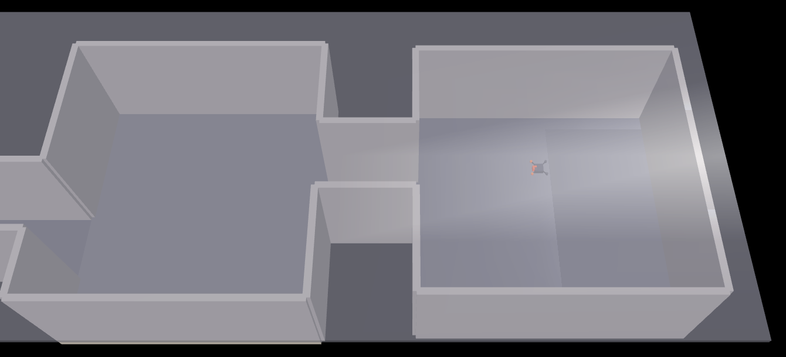
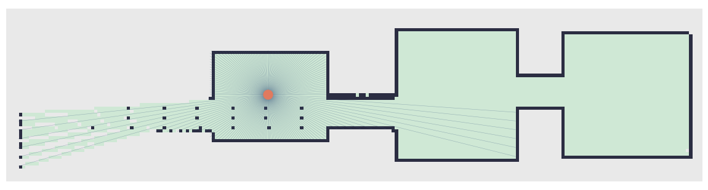

# Scanner

A drone that explores an unknown building on its own and builds a map of it, trained with reinforcement learning in MuJoCo.

The drone starts in the first room of a randomly generated building (2 to 4 rooms linked by corridors). It has no map and no GPS, only a LiDAR. The goal is to scan at least 90% of the reachable floor without hitting a wall or flipping over.



## How it works

- **Environment**: a new building is generated at every episode (room sizes, corridor positions and door offsets are random), then built as a MuJoCo model. Corridors are offset from each other so the drone cannot just look straight through every door.
- **Perception**: a 180-ray horizontal LiDAR, plus a few vertical rays for the relief. Every scan updates a 2D occupancy grid (free / occupied / unknown) at 15 cm resolution.
- **Observation**: a local crop of the occupancy grid (CNN), the direction and distance to the nearest frontiers (boundary between known and unknown space), a coarse summary of the LiDAR, the drone's own velocity and attitude (in the drone frame), and its last command.
- **Action**: the policy outputs a desired velocity (forward, sideways, vertical) and yaw rate. A cascaded PID controller turns that into a target attitude, then into motor torques, so the policy never has to balance the drone itself.
- **Reward**: newly discovered cells, a potential term that pulls toward frontiers, a large bonus when coverage reaches the target, and a penalty for crashing or flipping.
- **Training**: PPO (Stable-Baselines3) on several environments in parallel (CPU physics, optional GPU for the network).



*Occupancy grid after a partial flight: green is known free space, dark is wall, grey is still unknown. The blue lines are the last LiDAR scan.*

## Results

30 evaluation episodes on fixed seeds, 500k training steps, with the first controller (policy outputs motor torques directly). Success means reaching 90% coverage.

| Version | What changed | Success | Crash | Flipped | Mean coverage |
|---|---|---|---|---|---|
| v11 | damping on the drone body + angular velocity penalty | 43% | 47% | 10% | 81% |
| v16 | hard cap on horizontal speed (6 m/s) | 60% | 37% | 3% | 81% |
| v18 | 10x larger crash penalty | 67% | 20% | 13% | 82% |

Most failures were crashes inside rooms (not corridors) caused by braking or turning too late, not by a lack of space. The drone also held steep roll/pitch angles for long stretches, because moving sideways meant tilting it directly.

## Current work

Version 19 replaced direct torque control with the velocity-command + PID cascade described above. Roll and pitch now stay under 30 degrees, but the policy flew slowly and indecisively. The reward and observations were designed for the old controller, so v20 reworks them together: body-frame velocity, action smoothing, last command in the observation, and a proximity penalty. Evaluation of v20 is still to come.

## Project layout

| File | Purpose |
|---|---|
| `src/explorer_env.py` | Gymnasium environment (physics, LiDAR, reward) |
| `src/building_generator.py` | Random building layout and MuJoCo XML |
| `src/occupancy_grid.py` | Occupancy grid, frontier detection, coverage |
| `src/feature_extractor.py` | CNN + MLP feature extractor for PPO |
| `src/train.py` | Training script |
| `src/evaluate.py` | Evaluation and live rendering of a trained model |
| `src/check_reward_norm.py` | Shows how reward normalisation scales the penalties |
| `src/debug_grid.py` | Draws the occupancy map and LiDAR rays for one episode |
| `src/model_manager.py` | Model versioning and checkpoints |

## Usage

```
pip install -r requirements_runner.txt

python src/train.py --name explorer --damping 0.05 --death-penalty 500 --seed 42 --n-envs 8 --device auto --total-timesteps 500000
python src/evaluate.py --name explorer --n-episodes 30 --visual
```

Run each script with `--help` for the full list of options. `--n-envs` should not exceed your number of logical CPU cores.

## Stack

MuJoCo, Gymnasium, Stable-Baselines3, PyTorch, NumPy.
